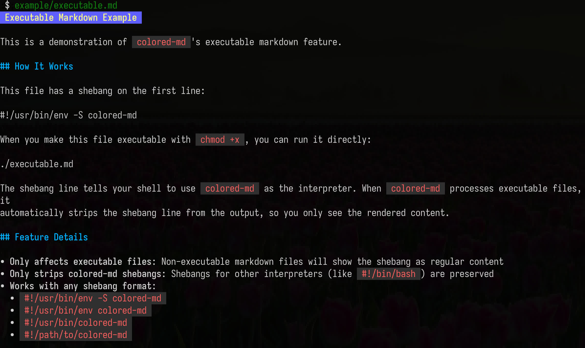

# colored-md

`colored-md` is a command-line utility for rendering Markdown files with syntax highlighting and formatting directly in your terminal.

It's built on top of the [charmbracelet/glamour](https://github.com/charmbracelet/glamour) library, providing a simple wrapper to bring rich, colored Markdown output to your CLI workflows.

## SYNOPSIS:

```bash
colored-md README.md
```

## OPTIONS:

* --help        Show help
* --version     Show version
* --styles      List supported styles

## Features

- Renders Markdown to ANSI-colored terminal output
- Customizable output width via `GLAMOUR_WIDTH` environment variable
- Customizable style via `GLAMOUR_STYLE` environment variable
- Supports overriding styling defaults
- Processes both piped input and specified file paths
- Supports executable markdown files with shebangs

## Example screenshot



## Installation

To install `colored-md`:

```bash
go install github.com/andrew-grechkin/colored-md@latest
```

## Usage

### Piping input

You can pipe Markdown content directly to `colored-md`:

```bash
echo -e "# Hello World\nThis is **bold** text." | colored-md
```

### Processing files

Specify one or more Markdown files as arguments:

```bash
colored-md README.md my_document.md
```

To read from standard input while also processing files, use `-` as a filename:

```bash
cat my_file.md | colored-md - README.md
```

### Executable markdown files

Make markdown files directly executable by adding a shebang:

```bash
#!/usr/bin/env -S colored-md
# My Document
Content here...
```

Then make the file executable and run it:

```bash
chmod +x document.md
./document.md
```

The shebang line will be automatically stripped from the rendered output. See `example/executable.md` for a working example.

### Customize output width

Set the `GLAMOUR_WIDTH` environment variable to control the word wrap width:

```bash
GLAMOUR_WIDTH=80 colored-md README.md
```

### Customize margins

```bash
GLAMOUR_OVERRIDE_MARGIN=2 colored-md README.md
GLAMOUR_OVERRIDE_MARGIN_CODE=8 colored-md README.md
```

### Styling

Set the `GLAMOUR_STYLE` environment variable to control the style:

```bash
GLAMOUR_STYLE=dracula colored-md README.md
```

Every style has following overrides:

- Document prefix and suffix new line is removed
- Undesired margin of 2 spaces on the left side of the whole document
- Code margin is removed

## Why `colored-md` over `glow`?

While `glow` is a popular Markdown renderer, `colored-md` was created to address specific shortcomings when used as a CLI filter:

- **Undesired directory traversal**: `glow` has functionality to traverse directories and find Markdown files, which is often not desired when simply piping content or processing specific files
- **Forced paging in pipelines**: `glow` tends to force paging (e.g., using `less`) even when used in pipelines, which can disrupt CLI workflows where direct output is expected
- **Overrides in styles**: `glow` uses styles provided by glamour as is, as described above these styles have undesired margins and paddings
- **Shebang support**: Self executable markdown files are not supported

`colored-md` aims to be a simpler, more predictable CLI filter for Markdown rendering, following strictly UNIX philosophy.

## Author

- Andrew Grechkin

## License

This project is licensed under the GNU General Public License Version 2 (GPLv2). See the `LICENSE` file for details.
